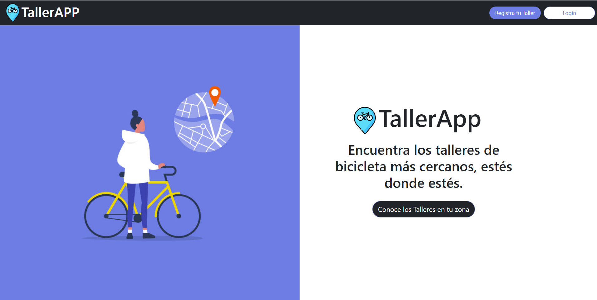
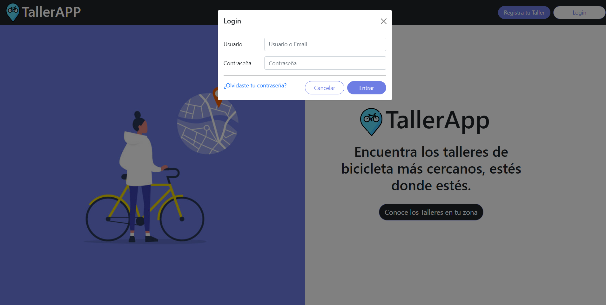
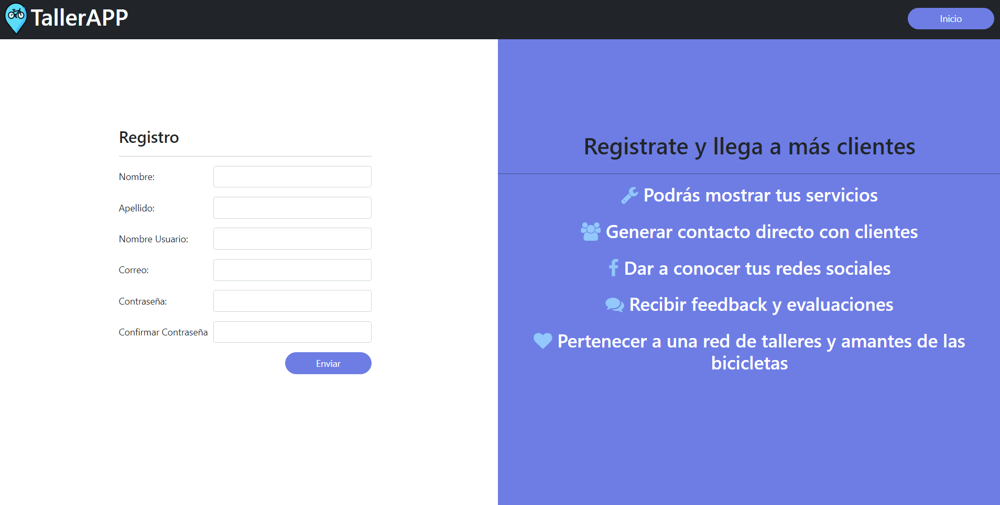
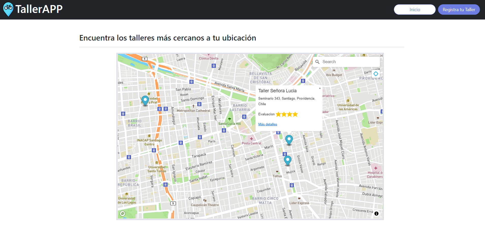
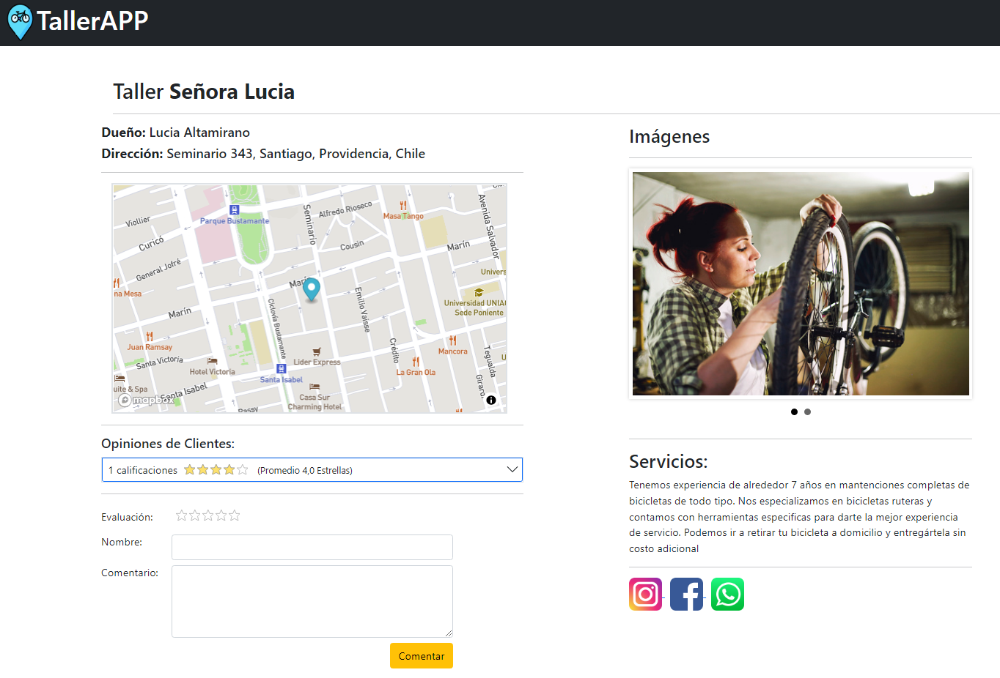
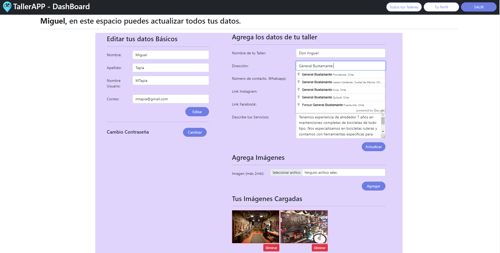
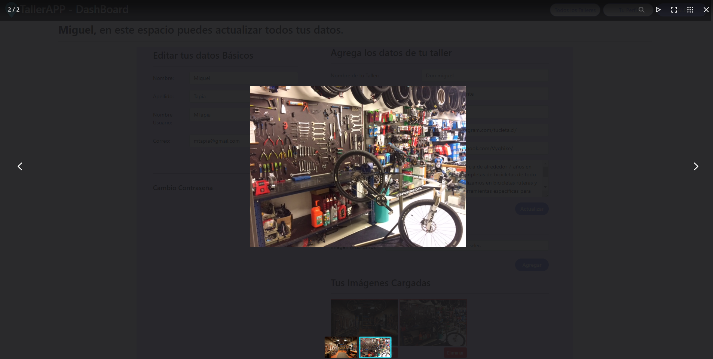
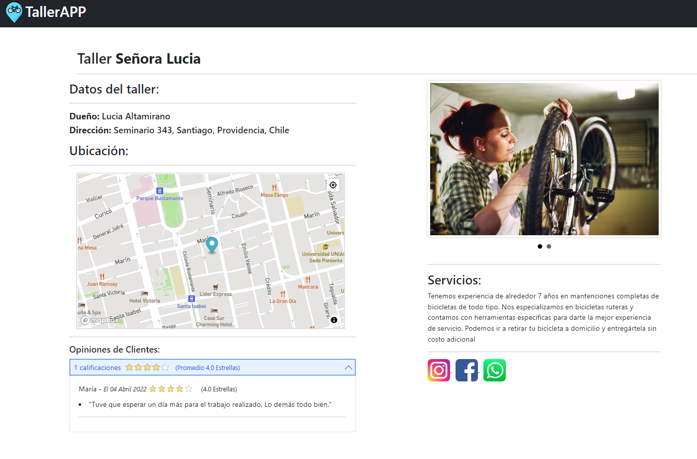
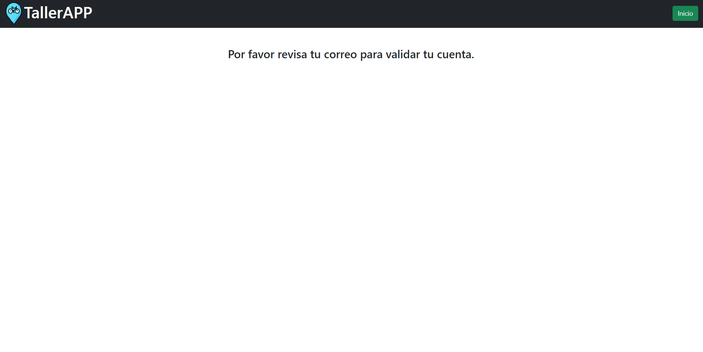
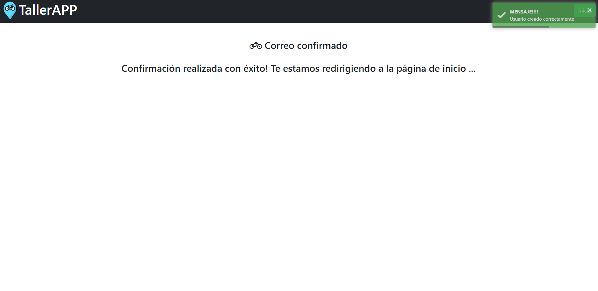

# TallerAPP-Django

Aplicación que muestra talleres de bicicleta cercanos a la ubicación actual, información detallada del taller y posibilidad de evaluaciones por parte de usuarios al taller. Utilizando Django, API Google Cloud, API Mapbox, Bootstrap, empleando base de datos relacionales.

Además se realiza confirmación de cuenta registrada a través de correo eléctronico gracias a la implementacion de Sendgrid. También se utiliza esta herramienta para la recuperación de contraseña.

Está aplicación tiene posibilidad de ser administrada a través del adminitrador de Django.

Las APIS y plugins utilizados en este proyecto se detallan a continuación:

• Implementación de autocompletado de dirección para dashboard de dueño de taller se utiliza Places API de Google cloud. [Places API](https://developers.google.com/maps/documentation/places/web-service)

• Implementación de mapa con geolocalización se utiliza API de MapBox. [Mapbox GL JS](https://docs.mapbox.com/mapbox-gl-js/guides/)

• Para guardar en base de datos la latitud y longitud exacta a partir de la dirección que ingresa el dueño de taller se utiliza libreria de Geocoder de Python [Geocoder](https://geocoder.readthedocs.io/)

• Confirmación de registro y recuperación de contraseña utilizando API de Sendgrid [Sendgrid](https://docs.sendgrid.com/for-developers)

• Implementación de bxSlider para realizar slider en las imagenes [bxSlider](https://bxslider.com/)

• Implementación de FancyBox para realizar efecto de aumento en las imagenes en el dashboard de dueño de taller [FancyBox](https://fancyapps.com/docs/ui/quick-start)

• Implementación de evaluación con estrellas a talleres, gracias a Krajee JQuery Plugings [Krajee-JQuery-Plugings](https://github.com/kartik-v/bootstrap-star-rating)

